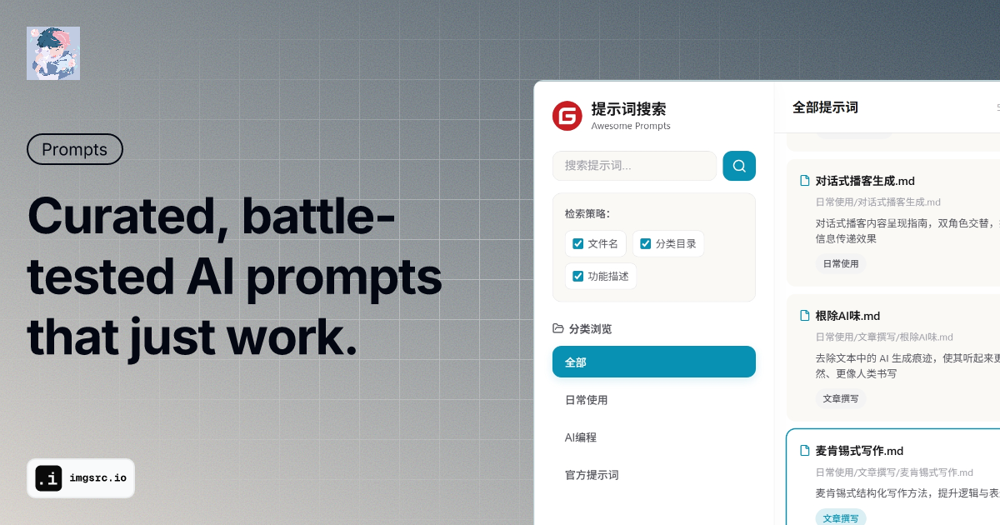

  
  
  

本项目用于集中展示各类 AI 提示词与规范。覆盖日常使用与专业编程，以下按目录结构列出所有提示词与规范，便于快速定位。

> [!NOTE]
> **📚 作者全新力作！** 专为零基础学习者打造的 AI 编程入门教程 —— [【hello-vibe】](https://gitee.com/ye_sheng0839/hello-vibe)
> 
> 从 Vibe Coding 核心理念到实战技巧，帮助你完成从程序员到项目师的思维转变。
> 在线阅读：👉 **<https://hello-vibe.311factory.top>** 👈

> [!TIP]
> 🎉 **2026.2.23 内容迁移！**：论文撰写相关内容已作为独立项目进行维护，论文写作经验+提示词+ skills 一键获取！新项目地址为：**<https://gitee.com/ye_sheng0839/paper-writing>**
>
>
> **2026.1.24 网页搜索！**：直接在网页中浏览、搜索、复制&下载，地址：**<https://awesome-prompts.311factory.top/>**

## 🛠️ 通用工具
---
- **[提示词设计(单轮模拟).md](提示词设计(单轮模拟).md)** - 模块化可复用提示词模板设计，单轮模拟，一次交付
- **[提示词设计(多轮交互).md](提示词设计(多轮交互).md)** - 英文原版4-D方法论优化提示词，多轮交互，明确需求

## 🏛️ 官方提示词
---
### 🤖 Gemini 3

- **[en.md](官方提示词/Gemini3/en.md)** - 原版英文Gemini 3系统提示词，九大核心推理规划原则
- **[zh.md](官方提示词/Gemini3/zh.md)** - Gemini 3系统提示词中文翻译版

### 🤖 Claude

- **[opus_4_5_soul_document_cleaned_up.md](官方提示词/Claude/opus_4_5_soul_document_cleaned_up.md)** - Claude官方系统提示词文档

### 🤖 Kiro

- **[System.md](官方提示词/Kiro/System.md)** - Kiro AI助手系统提示词
- **[vibe.md](官方提示词/Kiro/vibe.md)** - Kiro Vibe模式提示词
- **[spec.md](官方提示词/Kiro/spec.md)** - Kiro Spec模式提示词

> 更多官方提示词请参考：https://github.com/x1xhlol/system-prompts-and-models-of-ai-tools

## 📱 日常使用
---
### 🎨 图片生成

- **[LinkedIn信息图.md](日常使用/图片生成/LinkedIn信息图.md)** - 复杂想法转化为可分享的LinkedIn信息图
- **[产品UI对比稿.md](日常使用/图片生成/产品UI对比稿.md)** - 同一功能多种UI设计方案，便于横向对比
- **[代码可视化讲解.md](日常使用/图片生成/代码可视化讲解.md)** - 复杂算法或代码逻辑转化为可视化讲解图
- **[技术架构图.md](日常使用/图片生成/技术架构图.md)** - 生成专业技术架构图，展示系统或流程
- **[数据可视化.md](日常使用/图片生成/数据可视化.md)** - 数据集转化为直观的数据可视化图表
- **通用提示词构建**
  - **[README.md](日常使用/图片生成/通用提示词构建/README.md)** - Nano Banana提示词、风格与资源目录
  - **[Nanobanana.md](日常使用/图片生成/通用提示词构建/Nanobanana.md)** - 简单描述转Nano Banana Pro最佳实践提示词

### 🎬 视频生成

- **[视频关键帧制作.md](日常使用/视频生成/视频关键帧制作.md)** - AI视频关键帧制作流程，单张参考图转连贯电影级短镜头

### 📊 PPT制作

- **[PPT大纲.md](日常使用/PPT制作/PPT大纲.md)** - 按Minto金字塔结构生成中文PPT内容大纲
- **[PPT生成.md](日常使用/PPT制作/PPT生成.md)** - 基于风格要求和内容生成PPT
- **[时间轴拼贴图.md](日常使用/PPT制作/时间轴拼贴图.md)** - 地点历史描述转时间轴拼贴图AI绘图提示词

### 📖 辅助学习

- **[课间讲解.md](日常使用/辅助学习/课间讲解.md)** - 专业学科课件逐页系统学习与详细讲解
- **[NotebookLLM.md](日常使用/NotebookLLM.md)** - NotebookLLM 内容分析提示词模板，包含关键问题法、角色扮演、文献综述等多种分析模式

### � 文章撰写

- **[根除AI味.md](日常使用/文章撰写/根除AI味.md)** - 去除文本中的 AI 生成痕迹，使其听起来更自然、更像人类书写
- **[麦肯锡式写作.md](日常使用/文章撰写/麦肯锡式写作.md)** - 麦肯锡式结构化写作方法，提升逻辑与表达

### �🔧 其他工具

- **[回答多样化.md](日常使用/回答多样化.md)** - AI回答多样化方法，避免模式坍塌，提升回答多样性
- **[公众号封面生成.md](日常使用/公众号封面生成.md)** - 根据标题/类型匹配风格，生成公众号HTML封面代码
- **[对话式播客生成.md](日常使用/对话式播客生成.md)** - 对话式播客内容呈现指南，双角色交替，提升信息传递效果

### 🎭 角色扮演

- **[哲学家.md](日常使用/角色扮演/哲学家.md)** - 通过连续提问挖掘内心深处的构思、谬误、局限与潜能
- **[天赋挖掘师.md](日常使用/角色扮演/天赋挖掘师.md)** - 挖掘个人潜能与独特优势
- **[文本分析专家.md](日常使用/角色扮演/文本分析专家.md)** - 专业文本分析与解读
- **[造物主.md](日常使用/角色扮演/造物主.md)** - 创意构思与世界观构建

## 💻 AI编程
---
- **[AI_Coding_README.md](AI编程/README.md)** - AI编程思考：从demo到产品的挑战与思考

### 🔙 后端

- **[Django.md](AI编程/后端/Django.md)** - Python+Django，可扩展Web应用开发框架
- **[Fastapi.md](AI编程/后端/Fastapi.md)** - Python3.10+，FastAPI+Pydantic v2，异步优先HTTP API
- **[java-springboot.md](AI编程/后端/java-springboot.md)** - Java17/21+Spring Boot3.x，标准REST API

### 🎯 前端

- **[Frontend_README.md](AI编程/前端/README.md)** - 前端UI库按设计风格、功能特性和技术栈分类整理
- **[simple-rule.md](AI编程/前端/simple-rule.md)** - 前端UI/UX设计与开发的简单原则与规范，可以有效去除AI味

#### 框架

- **[angular.md](AI编程/前端/框架/angular.md)** - Angular18+TS+Jest，使用`for-next.function.ts`
- **[HTML+CSS.md](AI编程/前端/框架/HTML+CSS.md)** - HTML和CSS最佳实践，语义化、可访问性和响应式设计
- **[React.md](AI编程/前端/框架/React.md)** - TypeScript+Gatsby+React+Tailwind，函数式声明式编程
- **[React-components-creation.md](AI编程/前端/框架/React-components-creation.md)** - React/TS组件生成与适配流程（含Tailwind、shadcn/ui）
- **[Vue3-Nuxt.md](AI编程/前端/框架/Vue3-Nuxt.md)** - Vue3+Nuxt3+TS+Tailwind，Composition API

#### 🎨 UI美化

- **[UI美化.md](AI编程/前端/UI美化/UI美化.md)** - 高标准产品视觉设计方法论：挖掘需求、方案分级、质检
- **[前端美化lazy.md](AI编程/前端/UI美化/前端美化lazy.md)** - 前端美化懒人版，快速修复界面，打造简约高级风格
- **[UI转json.md](AI编程/前端/UI美化/UI转json.md)** - UI转JSON设计解析，将UI截图转换为JSON格式，便于AI复刻

### 🔄 全栈

- **[HTML+JS+CSS.md](AI编程/全栈/HTML+JS+CSS.md)** - Shopify主题开发，Liquid、HTML、CSS、JS和Online Store 2.0
- **[Nextjs.md](AI编程/全栈/Nextjs.md)** - Next.js14+Solidity+TypeScript+Viem/Wagmi，Web3全栈开发
- **[NuxtJS.md](AI编程/全栈/NuxtJS.md)** - Nuxt.js全栈开发规范

### 🕷️ 爬虫

- **[python爬虫.md](AI编程/爬虫/python爬虫.md)** - Python网络爬虫与数据提取，requests、BeautifulSoup等工具使用

### 🚀 部署

- **[Netlify.md](AI编程/部署/Netlify.md)** - Netlify平台：functions、Blobs、Image CDN等功能使用
- **[Edgeone.md](AI编程/部署/Edgeone.md)** - Cloudflare EdgeOne配置与实践

### 📋 代码规范

- **[code-guidelines.md](AI编程/代码规范/code-guidelines.md)** - 代码编写与修改的沟通约束准则
- **[code-styles.md](AI编程/代码规范/code-styles.md)** - 代码风格分析与一致性检查提示

### ⭐✨ 全局提示词 ⭐✨

> 🎯 **重磅推荐**：两套专业级全局提示词，全面提升 AI 编程能力！

- **[Global_Prompts_README.md](AI编程/全局提示词/README.md)** - 全局提示词使用指南，适配不同编程能力的AI助手和IDE

#### 🚀 reliable-coding

- **[Reliable_Coding_README.md](AI编程/全局提示词/reliable-coding/README.md)** - Reliable Coding Agent使用指南，适用于编程能力强的AI/IDE
- **[Claude-code.md](AI编程/全局提示词/reliable-coding/Claude-code.md)** - Claude Code版本
- **[Codex.md](AI编程/全局提示词/reliable-coding/Codex.md)** - Codex版本
- **[Cursor.md](AI编程/全局提示词/reliable-coding/Cursor.md)** - Cursor版本
- **[Gemini-CLI.md](AI编程/全局提示词/reliable-coding/Gemini-CLI.md)** - Gemini CLI版本

#### 🛡️ RIPER5

- **[RIPER5_README.md](AI编程/全局提示词/RIPER5/README.md)** - RIPER5五阶段工作流协议，适用于编程能力弱的AI/IDE
- **[RIPER5.md](AI编程/全局提示词/RIPER5/RIPER5.md)** - RIPER5完整协议文档

---

> 说明：使用范围集中在本 README，文档正文聚焦具体准则与示例。

